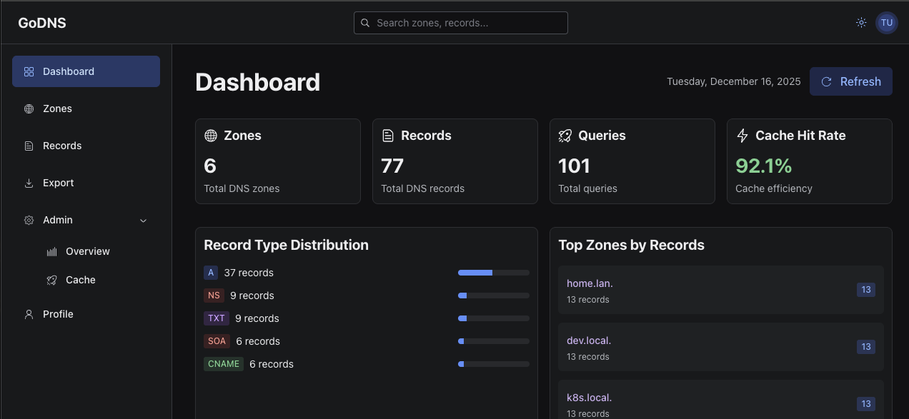

# GoDNS 🚀

[](https://github.com/rogerwesterbo/godns/actions/workflows/ci.yml)
[](https://github.com/rogerwesterbo/godns/actions/workflows/release.yml)
[](https://github.com/GoogleContainerTools/distroless)
[](https://go.dev/)

**A modern, high-performance DNS server with dynamic configuration, built-in web UI, and enterprise features.**

## ✨ Key Features

### 🎯 Core DNS

- **High-Performance Resolution** - Fast DNS query processing with intelligent caching
- **Dynamic Configuration** - Live updates via Valkey (Redis) backend - no restarts needed
- **Load Balancing** - Round-robin, weighted, least-connections, and random strategies
- **Health Checks** - Automatic backend monitoring with TCP/HTTP/HTTPS probes
- **Query Logging** - Detailed query analytics with persistent statistics

### 🔐 Security & Authentication

- **DNSSEC Support** - Automatic zone signing with ECDSA P-256 keys (KSK/ZSK)
- **OAuth2/OIDC** - Enterprise authentication via Keycloak integration
- **Rate Limiting** - Per-IP query rate limiting with configurable thresholds
- **ACL Support** - Valkey ACL-based access control
- **Distroless Images** - Minimal attack surface with Google Distroless base images
- **LAN Restrictions** - Configurable allowed networks for DNS queries

### 🌐 Management & APIs

- **Modern Web UI** - React-based dashboard with real-time stats
- **REST API** - Full-featured HTTP API with Swagger/OpenAPI documentation
- **CLI Tool** - Powerful command-line interface for testing and management
- **Admin Endpoints** - System stats, cache management, health monitoring
- **Export/Import** - BIND zone file format support

### ☸️ Operations

- **Kubernetes-Ready** - Helm charts with multi-pod safety
- **Health Probes** - Liveness and readiness endpoints for orchestration
- **Metrics** - Prometheus-compatible metrics endpoint
- **Persistent Stats** - Query statistics survive server restarts
- **Docker Compose** - Complete development stack included



## 🚀 Quick Start

### Option 1: Docker Compose (Recommended)

```bash
# Clone the repository
git clone https://github.com/rogerwesterbo/godns.git
cd godns

# Start all services (DNS + API + Web UI + Keycloak + Valkey)
docker-compose --profile api --profile ui up -d

# Or start specific components:
# docker-compose --profile api up -d  # Backend only
# docker-compose --profile ui up -d   # Frontend only

# Access services
# - DNS Server: localhost:14053
# - Web UI: http://localhost:14200
# - API: http://localhost:14000
# - Keycloak: http://localhost:14101
```

**Default credentials:**

- Web UI/CLI: `testuser` / `password`
- Keycloak Admin: `admin` / `admin`

### Option 2: Standalone Docker

```bash
# Pull and run DNS server
docker pull ghcr.io/rogerwesterbo/godns:latest
docker run -p 53:53/udp -p 53:53/tcp ghcr.io/rogerwesterbo/godns:latest

# Pull and run Web UI
docker pull ghcr.io/rogerwesterbo/godns-web:latest
docker run -p 8080:8080 ghcr.io/rogerwesterbo/godns-web:latest
```

### Option 3: Kubernetes (Helm)

```bash
# Install DNS server
helm install godns oci://ghcr.io/rogerwesterbo/helm/godns

# Install Web UI
helm install godnsweb oci://ghcr.io/rogerwesterbo/helm/godnsweb \
  --set ingress.enabled=true \
  --set ingress.hosts[0].host=godns.example.com
```

### Option 4: Binary Installation

Download the latest binary from the [Releases page](https://github.com/rogerwesterbo/godns/releases).

See the **[Binary Installation Guide](docs/BINARY_INSTALLATION.md)** for detailed instructions on how to run GoDNS as a standalone binary or systemd service.

## 🎮 Usage Examples

### Web UI

Navigate to `http://localhost:14200` and login with `testuser` / `password`

- View real-time query statistics
- Manage DNS zones and records
- Monitor cache performance
- Check load balancer health

### CLI Tool

```bash
# Download CLI binary
curl -LO https://github.com/rogerwesterbo/godns/releases/latest/download/godnscli-linux-amd64.tar.gz
tar -xzf godnscli-linux-amd64.tar.gz

# Login
./godnscli login

# Query DNS
./godnscli query example.lan

# Run tests
./godnscli test

# Export zones
./godnscli export --format bind
```

### REST API

```bash
# Get access token
TOKEN=$(curl -s -X POST "http://localhost:14101/realms/godns/protocol/openid-connect/token" \
  -d "client_id=godns-cli" \
  -d "username=testuser" \
  -d "password=password" \
  -d "grant_type=password" | jq -r '.access_token')

# List zones
curl -H "Authorization: Bearer $TOKEN" http://localhost:14000/api/v1/zones

# Get admin stats
curl -H "Authorization: Bearer $TOKEN" http://localhost:14000/api/v1/admin/stats

# View API docs
open http://localhost:14000/swagger/
```

### DNS Queries

```bash
# Standard dig
dig @localhost -p 14053 example.lan

# Check specific record type
dig @localhost -p 14053 api.example.lan A

# Trace query
dig @localhost -p 14053 +trace example.lan
```

## 📊 Admin Dashboard

Access the admin dashboard at `http://localhost:14200/admin` to view:

- **System Overview** - Uptime, zone/record counts, query totals
- **Cache Statistics** - Hit rates, size, efficiency metrics
- **Load Balancer** - Backend health, strategy, response times
- **Health Checks** - Target status, last check times, errors
- **Query Logs** - Real-time query analytics and statistics
- **Rate Limiter** - Active limiters, blocked queries

## 📚 Documentation

### Essential Guides

- **[Quick Start](docs/QUICK_START.md)** - 5-minute setup walkthrough
- **[Testing Guide](docs/TESTING_GUIDE.md)** - Complete testing documentation
- **[API Documentation](docs/API_DOCUMENTATION.md)** - REST API reference
- **[DNS Record Types](docs/DNS_RECORD_TYPES.md)** - Complete record type reference
- **[Helper Scripts](scripts/README.md)** - Setup, testing, and development scripts

### Configuration

- **[Authentication](docs/AUTHENTICATION.md)** - OAuth2/OIDC setup and configuration
- **[CLI Guide](docs/CLI_GUIDE.md)** - Command-line interface complete guide
- **[Features Guide](docs/FEATURES_GUIDE.md)** - Detailed feature documentation

### Advanced

- **[Keycloak Setup](docs/KEYCLOAK_SETUP.md)** - Custom Keycloak configuration
- **[Web UI README](web/godnsweb/README.md)** - Web application documentation

## 🛠️ Development

### Prerequisites

- Go 1.25.x+
- Docker & Docker Compose
- Node.js 18+ (for Web UI development)

### Build Commands

```bash
# Build DNS server
make build

# Build CLI tool
make build-cli

# Build Web UI
cd web/godnsweb && npm run build

# Run tests
make test

# Run linting
make lint

# Build Docker images
make docker-build
```

### Project Structure

```
godns/
├── cmd/
│   ├── godns/          # DNS server with integrated HTTP API
│   └── godnscli/       # CLI tool
├── internal/
│   ├── dnsserver/      # DNS query handlers
│   ├── httpserver/     # HTTP API & admin endpoints
│   └── services/       # Core services (cache, rate limiting, etc.)
├── pkg/                # Public packages
├── web/godnsweb/       # React Web UI
├── charts/             # Helm charts
├── docs/               # Documentation
└── scripts/            # Helper scripts (seeding, setup, testing)
```

## 🔧 Configuration

Configuration via environment variables. Key settings:

```bash
# DNS Server
DNS_SERVER_PORT=14053
DNS_UPSTREAM_SERVER=8.8.8.8:53

# Caching
DNS_CACHE_ENABLED=true
DNS_CACHE_SIZE=10000
DNS_CACHE_TTL_SECONDS=300

# Rate Limiting
DNS_RATE_LIMIT_ENABLED=true
DNS_RATE_LIMIT_QUERIES_PER_SEC=100

# Load Balancing
DNS_LOAD_BALANCER_ENABLED=true
DNS_LOAD_BALANCER_STRATEGY=round-robin  # weighted-round-robin, least-connections, random

# Health Checks
DNS_HEALTH_CHECK_ENABLED=true
DNS_HEALTH_CHECK_INTERVAL_SEC=30

# Authentication
AUTH_ENABLED=true
KEYCLOAK_URL=http://localhost:14101
KEYCLOAK_REALM=godns

# Valkey (Redis)
VALKEY_HOST=localhost
VALKEY_PORT=14103
```

See `.env.example` for all options.

## 🐳 Container Images

Built with Google Distroless for maximum security:

```bash
# DNS Server
ghcr.io/rogerwesterbo/godns:latest
ghcr.io/rogerwesterbo/godns:v1.0.0

# Web UI
ghcr.io/rogerwesterbo/godns-web:latest
ghcr.io/rogerwesterbo/godns-web:v1.0.0
```

**Security Features:**

- ✅ Distroless base (no shell, minimal attack surface)
- ✅ Non-root user (UID 65532)
- ✅ Read-only root filesystem
- ✅ Multi-arch (amd64, arm64, arm/v7)
- ✅ Trivy security scanning
- ✅ Cosign image signing
- ✅ SBOM included

## 📦 Releases

Automated releases via GitHub Actions. Each release includes:

- Multi-arch Docker images
- CLI binaries (Linux, macOS, Windows)
- Helm charts
- Security scan results
- SBOM (Software Bill of Materials)

See [CHANGELOG](CHANGELOG.md) for release history.

## 🤝 Contributing

Contributions welcome! Please read [CONTRIBUTING.md](CONTRIBUTING.md) first.

## 📄 License

See [LICENSE](LICENSE) file.

---

**Made with ❤️ by the GoDNS team**
